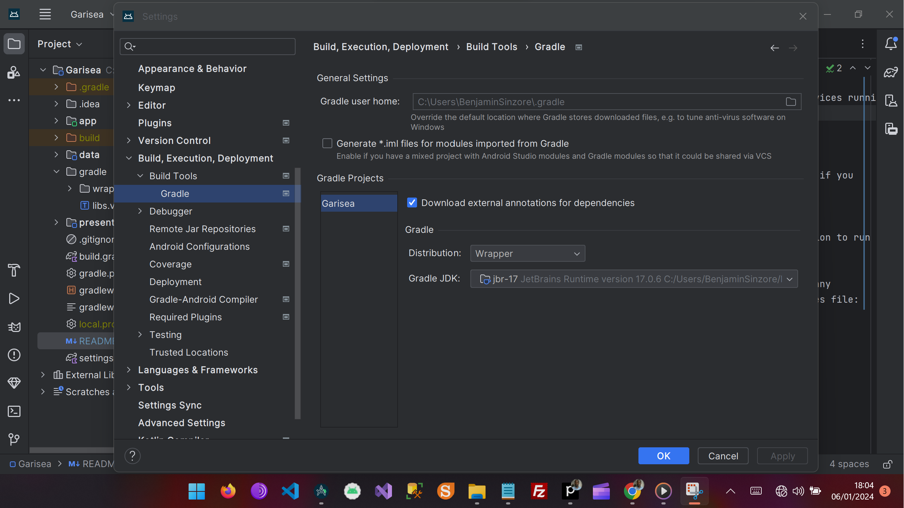
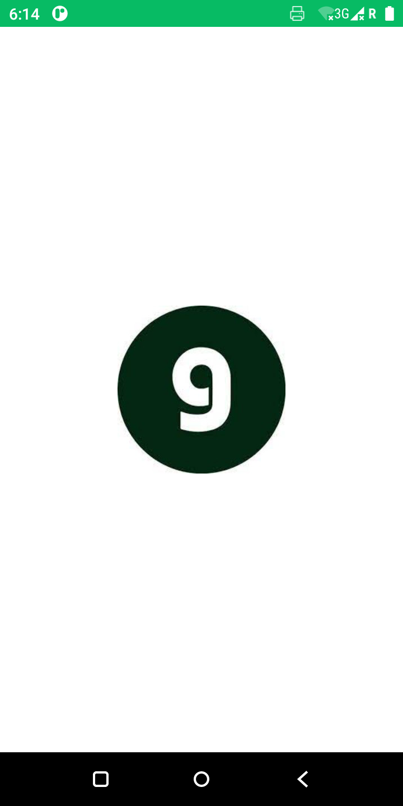
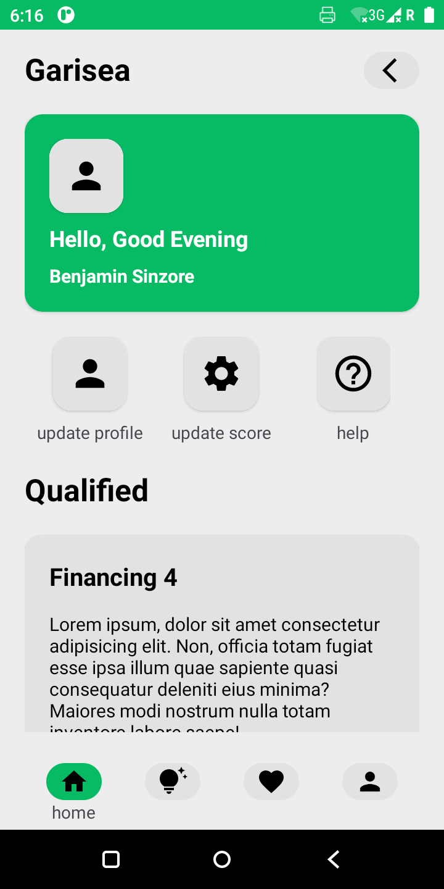
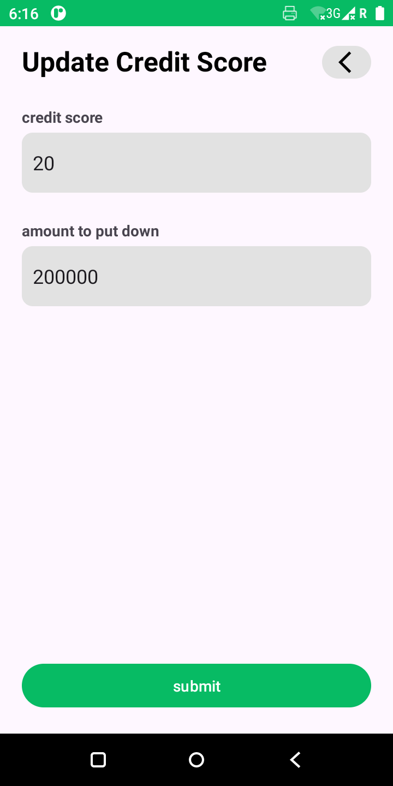
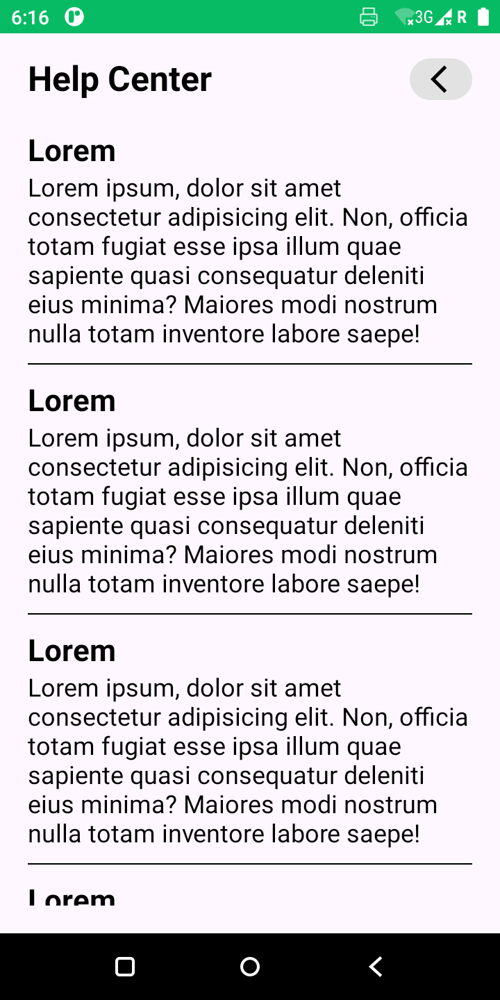
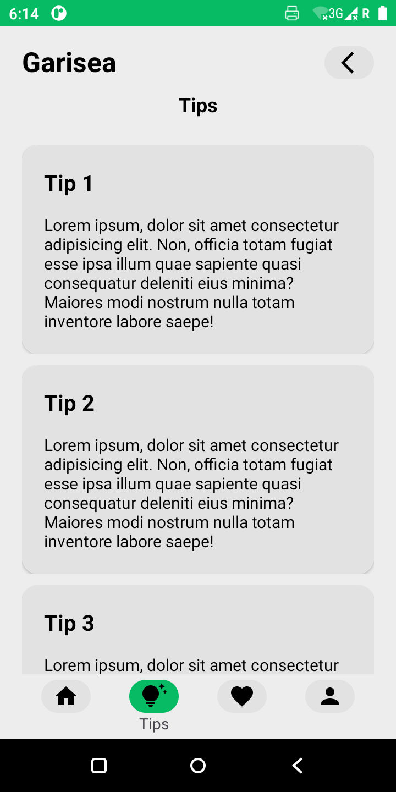
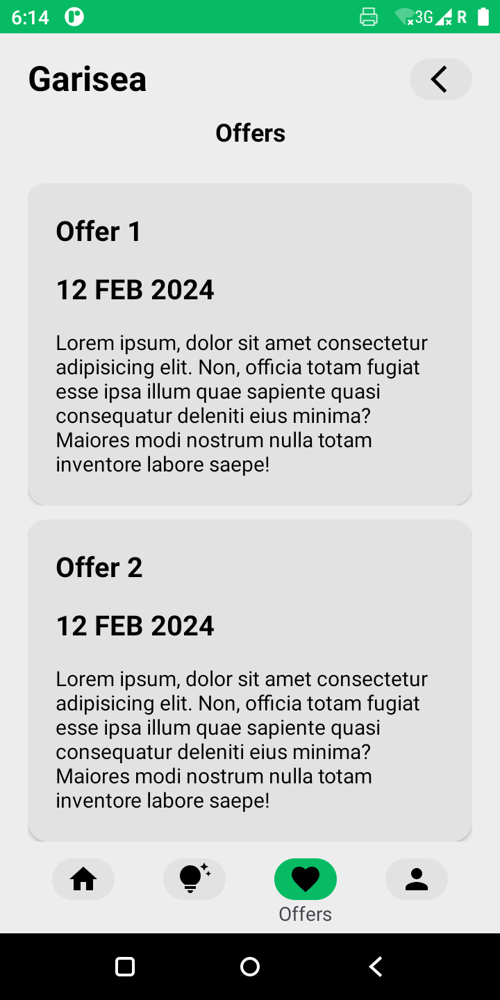
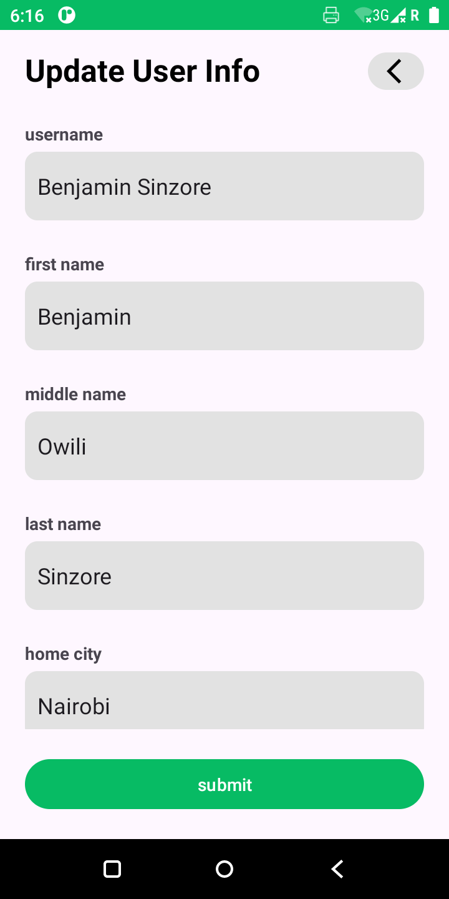

# Garisea Car Financing Application

This project is to fulfill the Technical interview process at Garisea. The app supports devices running Android 5.0+,
and is optimized for phones.

## Running the Project

To ensure the project runs on your local environment ensure you have Java 17 on your PC or if you
don't have you can install it
from [here](https://www.oracle.com/java/technologies/javase/jdk17-archive-downloads.html).

If you have multiple installations of Java make sure to set Java 17 as your preferred version to run
the project.

With the new Android Gradle Plugin version 8.0.0 and above, you need Java 17 to run the project and any
terminal commands. A workaround for this is to add this in your **global** gradle.properties file:

```properties
org.gradle.java.home=/Applications/Android Studio.app/Contents/jbr/Contents/Home
```

This simply sets the Gradle Java home to the one set in Android Studio. Android Studio
Flamingo comes bundled with Java 17. You only need to ensure the project uses Java 17. To do so,
go to **File -> Project Structure -> SDK Location -> Gradle Settings** and set the Java Version to
17 from the list that appears.



## Dependencies

1. JGlide - For loading images
2. Gson - For reading json files

## Architecture

The proposed architecture is as follows;

### Data

This layer will include;

1. Json Files
2. Adapters 
3. Models

### Presentation

1. View


## Dependencies

The project
uses [Versions Catalog](https://docs.gradle.org/current/userguide/platforms.html#sub:version-catalog)
to set up and share dependencies across the modules. The main reasons for choosing to adopt Versions
Catalog are:

- Central place to define dependencies.
- Easy syntax.
- Does not compromise on build speeds as changes do not need the module to be compiled.

To add a dependency, navigate to **gradle/libs.versions.toml*** file, which has all the dependencies
for the whole project. This file has the following sections:

[versions] is used to declare the version numbers that will be referenced later by plugins and
libraries.
[libraries] Define the libraries that will be later accessed in our Gradle files.
[bundles] Are used to define a set of dependencies. For this, we have `compose`, `room`, `lifecycle`
and `ktor` as examples.
[plugins] Used to define plugins.

You need to add your dependency version in [versions]. After defining the version, add your library in
the [libraries] section as:

```toml
androidx-splashscreen = { module = "androidx.core:core-splashscreen", version.ref = "splash" }
```

**Note**:

- You can use separators such as -, _v, . that will be normalized by Gradle to . in the Catalog and
  allow you to create subsections.
- Define variables using **CamelCase**.\
- Check if the library can be added to any existing bundles.

# APK Location

Change the view from Android to Project view, the Garisea - Main directory


# Screens

Splash Screen




Dashboard




Update User Info


Update User Score




Help Center




Tips




Offers




View User Info




